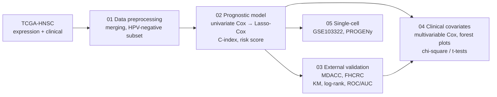

# Prognostic gene-expression signature for radiotherapy outcome in HPV-negative HNSCC


[](LICENSE)

Analysis code for a clinical–transcriptomic survival modelling study in head and neck
squamous cell carcinoma (HNSCC). The scripts build prognostic gene-expression signatures for
overall survival (OS) and progression-free survival (PFS) from TCGA patient data, stratify
patients into risk groups (with and without radiotherapy), validate the signatures in two
independent patient cohorts, relate the risk scores to clinical covariates, and examine
signature-gene expression and pathway activity at single-cell resolution.

## Related publication

The biological context of these analyses is described in:

> Broghammer F, Korovina I, Gouda M, *et al.* Resistance of HNSCC cell models to pan-FGFR
> inhibition depends on the EMT phenotype associating with clinical outcome.
> *Molecular Cancer* 23, 39 (2024). <https://doi.org/10.1186/s12943-024-01954-8>

Please refer to the article for the study design, the experimental work and the validated
results.

## Highlights

- **Clinical data integration.** Bulk tumour transcriptomes are merged with curated clinical
  annotation: HPV status, age, sex, AJCC stage, grade, anatomic site, radiotherapy, treatment
  outcome, and OS, PFS and DSS endpoints.
- **Survival machine learning.**
  - Univariate Cox screening of candidate genes.
  - Feature selection with **Lasso-penalised Cox regression** (scikit-survival `CoxnetSurvivalAnalysis`).
  - Time-series cross-validation, evaluated with the **concordance index (C-index)**.
- **Prediction model.** A multivariable Cox model gives patient **risk scores**. Patients are
  split at the median into high- and low-risk groups. The scripts report Kaplan–Meier curves,
  log-rank tests, hazard ratios, number-at-risk tables and **ROC/AUC**.
- **External validation.** The signatures are applied to two independent oral cavity SCC
  cohorts (MDACC and FHCRC), with collinearity checks (correlation, VIF).
- **Clinical covariate modelling.**
  - Multivariable Cox models with forest plots.
  - Chi-square and t-tests of risk groups and risk scores against clinical variables.
- **Multi-omics context.** The analyses combine bulk RNA-seq, microarray, single-cell RNA-seq
  and clinical data. In the single-cell data, signature-gene expression is correlated with
  **PROGENy** pathway activity scores.

## Workflow



## Overview of analyses

| Module | Data | Methods |
|---|---|---|
| `01_data_preprocessing` (R) | TCGA-HNSC gene expression and clinical data; MDACC (GSE42743) and FHCRC (GSE41613) cohorts | Ensembl→symbol mapping (biomaRt), log2 transformation, sample matching, clinical-variable harmonisation, endpoint-specific tables (OS, PFS, DSS) |
| `02_prognostic_model` (Python) | HPV-negative TCGA-HNSC | Univariate Cox (HR, C-index, log-rank), Lasso-Cox with time-series cross-validation, multivariable Cox risk score, KM by radiotherapy status, per-gene forest plots |
| `03_external_validation` (Python) | MDACC, FHCRC | Signature transfer (TCGA coefficients) and cohort-refitted Cox models, correlation/VIF filtering, KM/log-rank, ROC/AUC |
| `04_clinical_covariate_analysis` (R) | TCGA, MDACC, FHCRC | Multivariable Cox with clinical covariates, forest plots (`forestplot`, `forestmodel`), median-split risk groups, chi-square and t-tests vs. age, sex, stage, anatomic site, treatment, smoking |
| `05_single_cell` (R) | HNSCC scRNA-seq, GSE103322 (malignant cells) | Seurat (SCTransform, PCA, UMAP, t-SNE), feature/dot plots, PROGENy pathway scores, gene–pathway correlation heatmaps |

## Repository structure

```
scripts/
├── 01_data_preprocessing/            # R
├── 02_prognostic_model/              # Python (jupytext percent format)
├── 03_external_validation/           # Python (jupytext percent format)
├── 04_clinical_covariate_analysis/   # R
└── 05_single_cell/                   # R
data/README.md     # data sources and expected file layout
docs/              # notes on how the code was curated
environment/       # R package installer and conda environment
```

Each script begins with a short header that describes its purpose, inputs and outputs. Run
the scripts from the repository root. Inputs are read from `data/<dataset>/` and outputs are
written to `results/<module>/`. The Python scripts use the jupytext "percent" format, so they
can be opened as notebooks in Jupyter or VS Code.

## Data

No patient-level data are included in this repository. The datasets are publicly available
from TCGA/GDC, cBioPortal, UCSC Xena and GEO. [`data/README.md`](data/README.md) lists the
sources, accession numbers and the file layout the scripts expect.

## Software

- **R:** survival, survminer, forestplot, forestmodel, car, glmnet, caret, biomaRt, limma,
  edgeR, Seurat, progeny, ComplexHeatmap, pheatmap and tidyverse.
- **Python:** pandas, NumPy, scikit-learn, scikit-survival, lifelines, statsmodels,
  matplotlib and seaborn.

See [`environment/`](environment/) for setup files.

## Disclaimer

These scripts are shared for reference and transparency. They are **not** an official or
maintained software release of the publication above, and they are not a packaged,
end-to-end pipeline. They were developed interactively in an exploratory research setting
and are provided as is.

Results may differ from the published figures for several reasons:

- software versions
- cross-validation splits
- data release versions
- manual data-preparation steps (see [`data/README.md`](data/README.md))

For the authoritative methods and results, please refer to the published article.

## Citation

If these scripts are useful for your work, please cite the related article (see above and
[`CITATION.cff`](CITATION.cff)) and the original publications of the public datasets listed in
[`data/README.md`](data/README.md).

## License

Code is available under the [MIT License](LICENSE). Datasets remain subject to the terms of
their original repositories.
